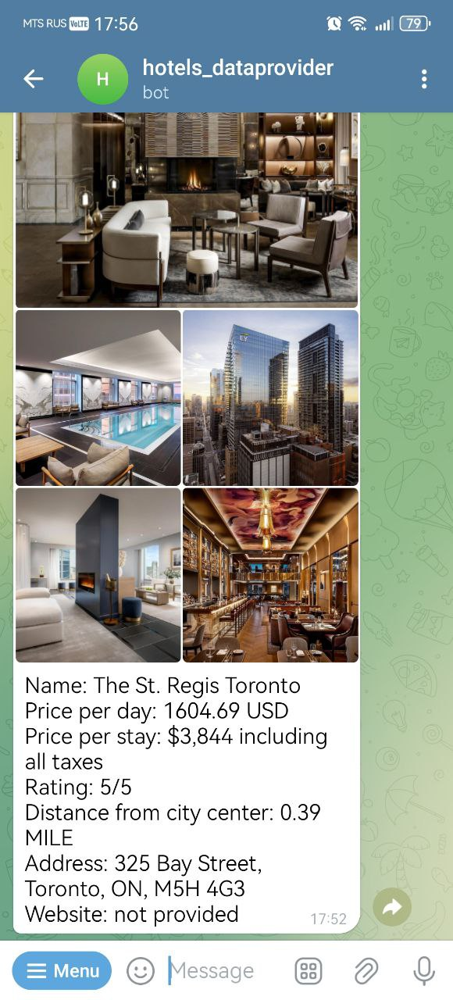

<h1 align="center"> Telegram Bot <br>"Global Hotel Search" </h1>
<p align="center">

</p>

### Description  ###

This is telegram bot assistant for searching hotels whole over the world.
Bot provides live data from Hotels.com https://www.hotels.com/ through
provider Hotels by Api Dojo https://rapidapi.com/apidojo/api/hotels4/.

### Functions ###

There are 3 hotel search functions available:

- Top Budget hotels search.
- Top Luxury hotels search.
- Custom hotels search.

In addition, bot supports functions:
- Help 
- History search

### Features ###

Telegram bot is:

- User friendly.
- Providing live data.
- Easy to launch.

### Project Stack ###

- written on Python 3.10.12
- used Docker Compose as a tool for running the application
- used TelegramBotAPI 4.14.0 for creating telegram bot
- used database SQLite and ORM Peewee for datastorage
- used Requests 2.31.0 and Backoff 2.2.1 for HTTP requests
- code is covered with Docstring and Type Hints

### Getting started 

This app is easy to start. Follow  the bellow requirements for Linux (Ubuntu): 

#### Installation

Ignore the following steps if you have already installed Docker Compose, Python 3.10.12 and Git.

1. Install docker engine and compose plugin for it.   
- Follow steps from official site:  [Docker Engine Install](https://docs.docker.com/engine/install/ubuntu/) and [Docker Compose Install](https://docs.docker.com/compose/install/)

2. Install one of:
- Python 3.10.12 from official site:  [Python Downloads](https://www.python.org/downloads/)
- IDE PyCharm with Python 3.10.12 from official site: [PyCharm Installation Guide](https://www.jetbrains.com/help/pycharm/installation-guide.html#standalone)

3. Install Git for "git clone" if required.
- Follow steps from official site: [Git install](https://git-scm.com/book/en/v2/Getting-Started-Installing-Git)

#### Clone or copy repository

Select one of the below options:
- git clone from https://github.com/ssergey-92/telegram_bot.git
- copy project from [github](https://github.com/ssergey-92/telegram_bot)

#### Add .env file

Rename ".env.template" to ".env" and insert required data.
- Register and get API key from [rapidapi](https://rapidapi.com/apidojo/api/hotels4/).
- Register new telegram bot and get Bot token from [Telegram BotFather](https://telegram.me/BotFather).

#### Running the application:

- From the command line: 
```
cd 'your path to project root directory'
python main.py
```
- From IDE PyCharm
```
run main.py
```

### Developer ###

This telegram bot was developed by Sergey Solop.  
Contact email for suggestions and feedbacks solop1992@mail.ru